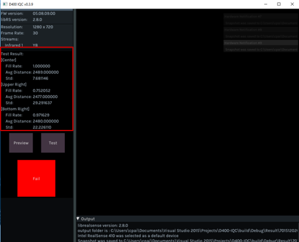
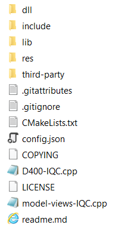
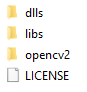

## Before Run CMake & build
* The CMakeLists.txt inside the pakcage assume you have copy the pre-built DLLs & Libs in the Release tab and copy to the root project folder.
* If you want to build the related dlls & libs by self, please modify the CMakeLists.txt.

## Build Environment
* LibRS 2.11.0 - Windows has pre-built dll inside while under linux, requires to build from source code.
* Windows RS2
* VisualStudio v14 2015, libraries built with v14, other than v14, please build from source code as needed.
	- For pre-built dlls and libs, please download them from release page and paste to the root directory.
* Ubuntu 16.04, OpenCV, Pkgconfig, X11, GTK3, pthread, RealSense required.
* CMake 2.8.3+

## Windows Folder structure
* In order to run the CMake on the project without problem, you need to follow below instruction to put dlls and libs if you build the dependent libraries by your own. If you download the pre-built libraries from release, you can ignore this section.
* Create "dll" folder, which contains sub-folders as below
	- dll/32/realsense2.dll (32 bits realsense2.dll)
	- dll/64/realsense2.dll (64 bits realsense2.dll)
* Create "lib" folder, which contains sub-folders as below
	- lib/32/glfw3.lib (32 bits glfw3.lib)
	- lib/32/realsense2.lib (32 bits realsense2.lib)
	- lib/64/glfw3.lib (64 bits glfw3.lib)
	- lib/64/realsense2.lib (64 bits realsense2.lib)
* Create "dlls" folder under "third-party/opencv"
	- dlls/32/opencv_world330.dll (32 bits opencv_world330.dll)
	- dlls/32/opencv_world330d.dll (32 bits opencv_world330d.dll)
	- dlls/64/opencv_world330.dll (64 bits opencv_world330.dll)
	- dlls/64/opencv_world330d.dll (64 bits opencv_world330d.dll)
	- libs/32/opencv_world330.lib (32 bits opencv_world330.lib)
	- libs/32/opencv_world330d.lib (32 bits opencv_world330d.lib)
	- libs/64/opencv_world330.lib (64 bits opencv_world330.lib)
	- libs/64/opencv_world330d.lib (64 bits opencv_world330d.lib)
	

 

## Overview

Depth Quality OEM Validation Software is the testing tool checking device quality through simple, cross-platform UI. The tool offers:

* Checking depth fill rate and distance from 80% ROI on image.
* All the testing criteria please refer to datasheet.
* Testing result will be shown at the left side panel with "Pass" or "Fail" also the test result.
* Testing result will also be saved inside the Result folder which located along with the software binary.
* Saved result include csv file, depth/color image and Left/Right IR image.

## Implementation Notes

You can get Depth Quality OEM Validation Software in form of a binary package on Windows and Linux, or build it from source alongside the rest of the library. The IQC tool is designed to be lightweight, requiring only a handful of embeded dependencies. Cross-platform UI is a combination of raw OpenGL calls, GLFW for cross-platform window and event management, and IMGUI for the interface elements. Please see COPYING for full list of attributions.