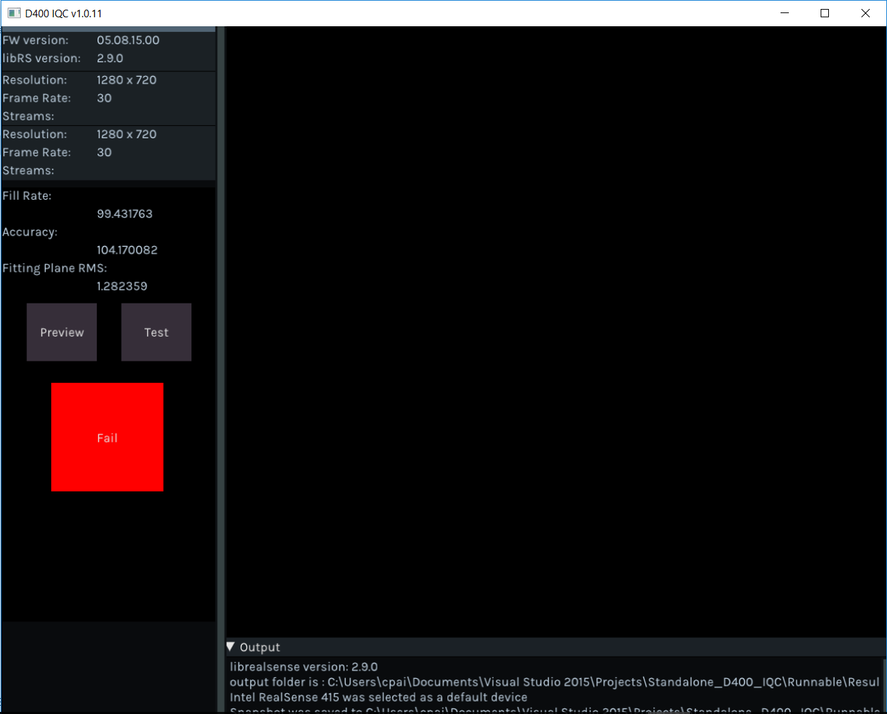

## Before Run CMake & build
* The CMakeLists.txt inside the pakcage assume you have copy the pre-built DLLs & Libs in the Release tab and copy to the root project folder.
* If you want to build the related dlls & libs by self, please modify the CMakeLists.txt.

## Build Environment
* LibRS 2.9.0 - Windows has pre-built dll inside while under linux, requires to build from source code.
* Windows RS2
* VisualStudio v14 2015, libraries built with v14, other than v14, please build from source code as needed.
	- For pre-built dlls and libs, please download them from release page and paste to the root directory.
* Ubuntu 16.04, OpenCV, Pkgconfig, X11, GTK3, pthread, RealSense required.
* CMake 2.8.3+

## Overview

D400 IQC is the testing tool checking device quality through simple, cross-platform UI. The tool offers:

* Checking depth fill rate and distance from 80% ROI on image.
* JSON file provide flexibility for customer to change the test criteria.
	- FillRatePassPercentage: Result needs to lager than 99% to pass fill rate test.
    - AccuracyPassPercentage: Accuracy error rate, should be under 2%.
	- TestDistance(mm): Test ground truth distance, default is "2000mm".
	- PostProcessing: Enable/Disable the post process before test, default is "enable".
	- RMSFittingPlanePassRate: Point to fitting plane error rate, should be under 2%.
	- ROIPercentag: Testing area ratio of the whole image, default is "80%".
	- MaxAngle: When the camera pose indicator will appear, suggested test angle to target should be under 3 degree.
* Testing result will be shown at the left side panel with "Pass" or "Fail" also the test result.
* Testing result will also be saved inside the Result folder which located along with the IQC binary.
* Saved result include csv file, depth/color image and Left/Right IR image.

## Implementation Notes

You can get D400 IQC in form of a binary package on Windows and Linux, or build it from source alongside the rest of the library. The IQC tool is designed to be lightweight, requiring only a handful of embeded dependencies. Cross-platform UI is a combination of raw OpenGL calls, GLFW for cross-platform window and event management, and IMGUI for the interface elements. Please see COPYING for full list of attributions.